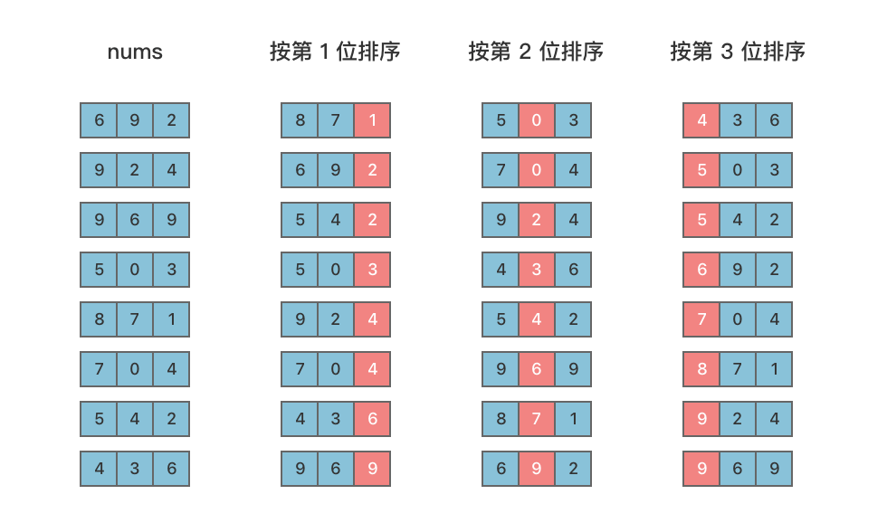

# 01.03.13 基数排序（第 08 天）

## 1. 基数排序算法思想

> **基数排序（Radix Sort）基本思想**：
>
> 将整数按位数切割成不同的数字，然后从低位开始，依次到高位，逐位进行排序，从而达到排序的目的。

## 2. 基数排序算法步骤

基数排序算法可以采用「最低位优先法（Least Significant Digit First）」或者「最高位优先法（Most Significant Digit first）」。最常用的是「最低位优先法」。

下面我们以最低位优先法为例，讲解一下算法步骤。

1. **确定排序的最大位数**：遍历数组元素，获取数组最大值元素，并取得对应位数。
2. **从最低位（个位）开始，到最高位为止，逐位对每一位进行排序**：
   1. 定义一个长度为 $10$ 的桶数组 $buckets$，每个桶分别代表 $0 \sim 9$ 中的 $1$ 个数字。
   2. 按照每个元素当前位上的数字，将元素放入对应数字的桶中。
   3. 清空原始数组，然后按照桶的顺序依次取出对应元素，重新加入到原始数组中。


我们以 $[692, 924, 969, 503, 871, 704, 542, 436]$ 为例，演示一下基数排序的整个步骤。



## 3. 基数排序代码实现

```python
class Solution:
    def radixSort(self, nums: [int]) -> [int]:
        # 桶的大小为所有元素的最大位数
        size = len(str(max(nums)))
        
        # 从最低位（个位）开始，逐位遍历每一位
        for i in range(size):
            # 定义长度为 10 的桶数组 buckets，每个桶分别代表 0 ~ 9 中的 1 个数字。
            buckets = [[] for _ in range(10)]
            # 遍历数组元素，按照每个元素当前位上的数字，将元素放入对应数字的桶中。
            for num in nums:
                buckets[num // (10 ** i) % 10].append(num)
            # 清空原始数组
            nums.clear()
            # 按照桶的顺序依次取出对应元素，重新加入到原始数组中。
            for bucket in buckets:
                for num in bucket:
                    nums.append(num)
                    
        # 完成排序，返回结果数组
        return nums
    
    def sortArray(self, nums: [int]) -> [int]:
        return self.radixSort(nums)
```

## 4. 基数排序算法分析

- **时间复杂度**：$O(n \times k)$。其中 $n$ 是待排序元素的个数，$k$ 是数字位数。$k$ 的大小取决于数字位的选择（十进制位、二进制位）和待排序元素所属数据类型全集的大小。
- **空间复杂度**：$O(n + k)$。
- **排序稳定性**：基数排序采用的桶排序是稳定的。基数排序是一种 **稳定排序算法**。