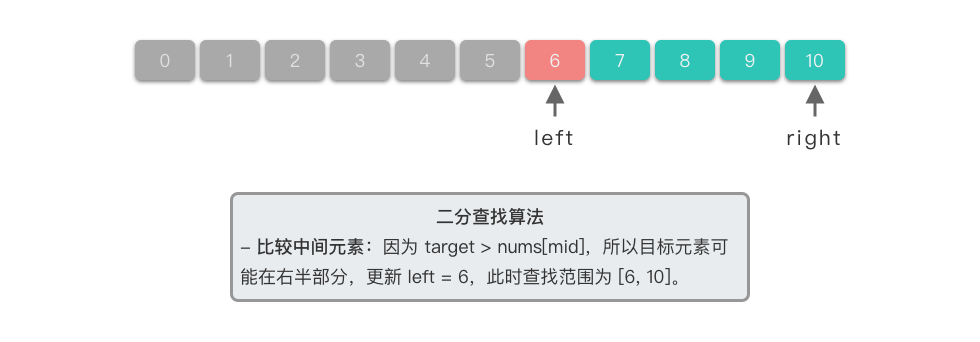
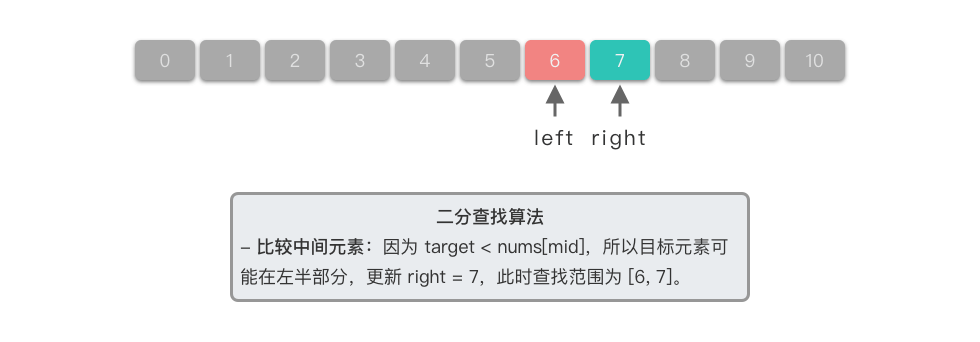
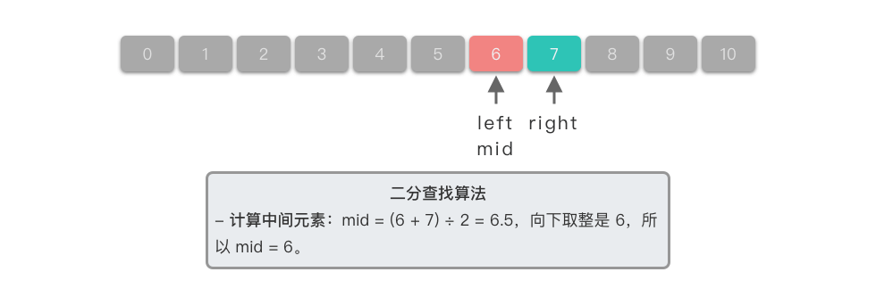

# 01.04.01 二分查找知识（一）（第 09 ~ 11 天）

## 1. 二分查找算法介绍

### 1.1 二分查找算法简介

> **二分查找算法（Binary Search Algorithm）**：也叫做折半查找算法、对数查找算法，是一种用于在有序数组中查找特定元素的高效搜索算法。

二分查找的基本算法思想为：通过确定目标元素所在的区间范围，反复将查找范围减半，直到找到元素或找不到该元素为止。

### 1.2 二分查找算法步骤

以下是二分查找算法的基本步骤：

1. **初始化**：首先，确定要查找的有序数据集合。可以是一个数组或列表，确保其中的元素按照升序或者降序排列。
2. **确定查找范围**：将整个有序数组集合的查找范围确定为整个数组范围区间，即左边界 $left$ 和右边界 $right$。
3. **计算中间元素**：根据 $mid = \lfloor (left + right) / 2 \rfloor$ 计算出中间元素下标位置 $mid$。
4. **比较中间元素**：将目标元素 $target$ 与中间元素 $nums[mid]$ 进行比较：
   1. 如果 $target == nums[mid]$，说明找到 $target$，因此返回中间元素的下标位置 $mid$。
   2. 如果 $target < nums[mid]$，说明目标元素在左半部分（$[left, mid - 1]$），更新右边界为中间元素的前一个位置，即 $right = mid - 1$。
   3. 如果 $target > nums[mid]$，说明目标元素在右半部分（$[mid + 1, right]$），更新左边界为中间元素的后一个位置，即 $left = mid + 1$。

5. 重复步骤 $3 \sim 4$，直到找到目标元素时返回中间元素下标位置，或者查找范围缩小为空（左边界大于右边界），表示目标元素不存在，此时返回 $-1$。

举个例子来说，以在有序数组 $[0, 1, 2, 3, 4, 5, 6, 7, 8, 9, 10]$ 中查找目标元素 $6$ 来说，使用二分查找算法的步骤如下：

1. **确定查找范围**：初始时左边界 $left$ 为 $0$（数组的起始位置），$right$ 为 $10$（数组的末尾位置）。此时查找范围为 $[0, 10]$。
2. **计算中间元素**：中间元素下标位置为 $5$，对应元素为 $nums[5] == 5$。
3. **比较中间元素**：因为 $6 > nums[5]$，所以目标元素可能在右半部分，更新左边界为中间元素的后一个位置，即 $left = 5$。此时查找范围为 $[5, 10]$。
4. **计算中间元素**：中间元素下标位置为 $7$，对应元素为 $nums[7] == 7$。
5. **比较中间元素**：因为 $6 < nums[7]$，所以目标元素可能在左半部分，更新右边界为中间元素的前一个位置，即 $right = 6$。此时查找范围为 $[5, 6]$。
6. **计算中间元素**：中间元素下标位置为 $5$，对应元素为 $nums[5] == 5$。
7. **比较中间元素**：因为 $5 == nums[5]$，正好是我们正在查找的目标元素，此时返回中间元素的下标位置，算法结束。

于是我们发现，对于一个长度为 $10$ 的有序数组，我们只进行了 $3$ 次查找就找到了目标元素。而如果是按照顺序依次遍历数组，则在最坏情况下，我们可能需要查找 $10$ 次才能找到目标元素。

<!-- tabs:start --> 

#### **<1>**


#### **<2>**


#### **<3>**


#### **<4>**



#### **<5>**


#### **<6>**



#### **<7>**



#### **<8>**


<!-- tabs:end -->

### 1.2 二分查找算法思想

二分查找算法是经典的 **「减而治之」** 的思想。

这里的 **「减」** 是减少问题规模的意思，**「治」** 是解决问题的意思。**「减」** 和 **「治」** 结合起来的意思就是 **「排除法解决问题」**。即：**每一次查找，排除掉一定不存在目标元素的区间，在剩下可能存在目标元素的区间中继续查找。**

每一次通过一些条件判断，将待搜索的区间逐渐缩小，以达到「减少问题规模」的目的。而于问题的规模是有限的，经过有限次的查找，最终会查找到目标元素或者查找失败。

## 2. 简单二分查找

下面通过一个简单的例子来讲解下二分查找的思路和代码。

- 题目链接：[704. 二分查找](https://leetcode.cn/problems/binary-search/)

### 2.1 题目大意

**描述**：给定一个升序的数组 $nums$，和一个目标值 $target$。

**要求**：返回 $target$ 在数组中的位置，如果找不到，则返回 $-1$。

**说明**：

- 你可以假设 $nums$ 中的所有元素是不重复的。
- $n$ 将在 $[1, 10000]$ 之间。
- $nums$ 的每个元素都将在 $[-9999, 9999]$之间。

**示例**：

```python
输入: nums = [-1,0,3,5,9,12], target = 9
输出: 4
解释: 9 出现在 nums 中并且下标为 4


输入: nums = [-1,0,3,5,9,12], target = 2
输出: -1
解释: 2 不存在 nums 中因此返回 -1
```

### 2.2 解题思路

#### 思路 1：二分查找

1. 设定左右边界为数组两端，即 $left = 0$，$right = len(nums) - 1$，代表待查找区间为 $[left, right]$（左闭右闭区间）。
2. 取两个节点中心位置 $mid$，先比较中心位置值 $nums[mid]$ 与目标值 $target$ 的大小。
   1. 如果 $target == nums[mid]$，则返回中心位置。
   2. 如果 $target > nums[mid]$，则将左节点设置为 $mid + 1$，然后继续在右区间 $[mid + 1, right]$ 搜索。
   3. 如果 $target < nums[mid]$，则将右节点设置为 $mid - 1$，然后继续在左区间 $[left, mid - 1]$ 搜索。
3. 如果左边界大于右边界，查找范围缩小为空，说明目标元素不存在，此时返回 $-1$。

#### 思路 1：代码

```python
class Solution:
    def search(self, nums: List[int], target: int) -> int:
        left, right = 0, len(nums) - 1
        
        # 在区间 [left, right] 内查找 target
        while left <= right:
            # 取区间中间节点
            mid = (left + right) // 2
            # 如果找到目标值，则直接返回中心位置
            if nums[mid] == target:
                return mid
            # 如果 nums[mid] 小于目标值，则在 [mid + 1, right] 中继续搜索
            elif nums[mid] < target:
                left = mid + 1
            # 如果 nums[mid] 大于目标值，则在 [left, mid - 1] 中继续搜索
            else:
                right = mid - 1
        # 未搜索到元素，返回 -1
        return -1
```

#### 思路 1：复杂度分析

- **时间复杂度**：$O(\log n)$。
- **空间复杂度**：$O(1)$。