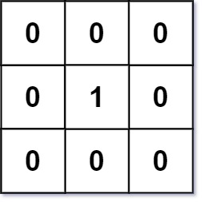

# 02.05.03 练习题目（第 14 天）

## 1. [0542. 01 矩阵](https://leetcode.cn/problems/01-matrix/)

### 1.1 题目大意

**描述**：给定一个 $m * n$ 大小的、由 `0` 和 `1` 组成的矩阵 $mat$。

**要求**：输出一个大小相同的矩阵 $res$，其中 $res[i][j]$ 表示对应位置元素（即 $mat[i][j]$）到最近的 $0$ 的距离。

**说明**：

- 两个相邻元素间的距离为 $1$。
- $m == mat.length$。
- $n == mat[i].length$。
- $1 \le m, n \le 10^4$。
- $1 \le m * n \le 10^4$。
- $mat[i][j] === 0$ 或者 $mat[i][j] == 1$。
- $mat$ 中至少有一个 $0$。

**示例**：



```python
输入：mat = [[0,0,0],[0,1,0],[0,0,0]]
输出：[[0,0,0],[0,1,0],[0,0,0]]
```


```python
输入：mat = [[0,0,0],[0,1,0],[1,1,1]]
输出：[[0,0,0],[0,1,0],[1,2,1]]
```

## 2. [0322. 零钱兑换](https://leetcode.cn/problems/coin-change/)

### 2.1 题目大意

**描述**：给定代表不同面额的硬币数组 `coins` 和一个总金额 `amount`。

**要求**：求出凑成总金额所需的最少的硬币个数。如果无法凑出，则返回 -1。

**说明**：

- $1 \le coins.length \le 12$。
- $1 \le coins[i] \le 2^{31} - 1$。
- $0 \le amount \le 10^4$。

**示例**：

```python
输入：coins = [1, 2, 5], amount = 11
输出：3 
解释：11 = 5 + 5 + 1


输入：coins = [2], amount = 3
输出：-1
```

## 3. [剑指 Offer 13. 机器人的运动范围](https://leetcode.cn/problems/ji-qi-ren-de-yun-dong-fan-wei-lcof/)

### 3.1 题目大意

**描述**：有一个 `m * n` 大小的方格，坐标从 `(0, 0)` 到 `(m - 1, n - 1)`。一个机器人从 `(0, 0)` 处的格子开始移动，每次可以向上、下、左、右移动一格（不能移动到方格外），也不能移动到行坐标和列坐标的数位之和大于 `k` 的格子。现在给定 `3` 个整数 `m`、`n`、`k`。

**要求**：计算并输出该机器人能够达到多少个格子。

**说明**：

- $1 \le n, m \le 100$。
- $0 \le k \le 20$。

**示例**：

```python
输入：m = 2, n = 3, k = 1
输出：3


输入：m = 3, n = 1, k = 0
输出：1
```