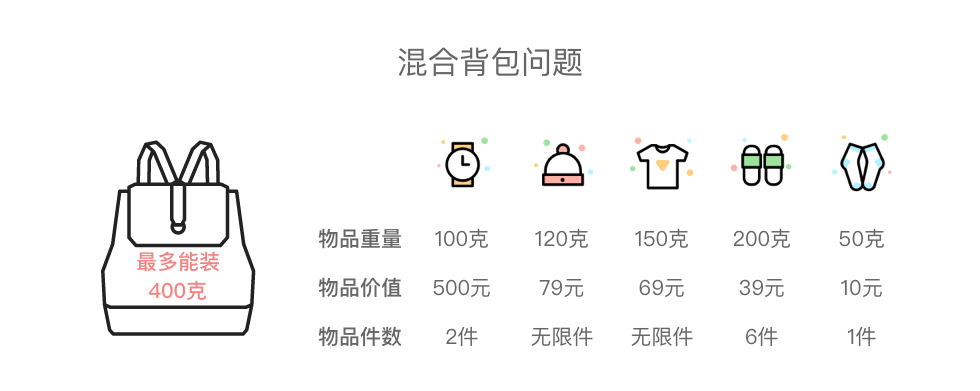
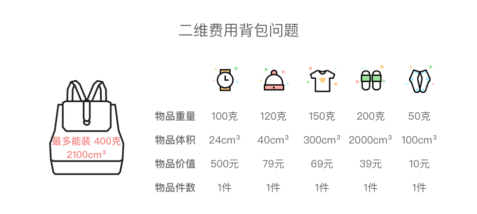

# 05.03.04 背包问题（四）（第 07 ~ 09 天）

## 5. 混合背包问题

> **混合背包问题**：有 $n$ 种物品和一个最多能装重量为 $W$ 的背包，第 $i$ 种物品的重量为 $weight[i]$，价值为 $value[i]$，件数为 $count[i]$。其中：
>
> 1. 当 $count[i] = -1$ 时，代表该物品只有 $1$ 件。
> 2. 当 $count[i] = 0$ 时，代表该物品有无限件。
> 3. 当 $count[i] > 0$ 时，代表该物品有 $count[i]$ 件。
>
> 请问在总重量不超过背包载重上限的情况下，能装入背包的最大价值是多少？



#### 思路 1：动态规划

混合背包问题其实就是将「0-1 背包问题」、「完全背包问题」和「多重背包问题」这 $3$ 种背包问题综合起来，有的是能取 $1$ 件，有的能取无数件，有的只能取 $count[i]$ 件。

其实只要理解了之前讲解的这 $3$ 种背包问题的核心思想，只要将其合并在一起就可以了。

并且在「多重背包问题」中，我们曾经使用「二进制优化」的方式，将「多重背包问题」转换为「0-1 背包问题」，那么在解决「混合背包问题」时，我们也可以先将「多重背包问题」转换为「0-1 背包问题」，然后直接再区分是「0-1 背包问题」还是「完全背包问题」就可以了。

#### 思路 1：代码

```Python
class Solution:
    def mixedPackMethod1(self, weight: [int], value: [int], count: [int], W: int):
        weight_new, value_new, count_new = [], [], []
        
        # 二进制优化
        for i in range(len(weight)):
            cnt = count[i]
            # 多重背包问题，转为 0-1 背包问题
            if cnt > 0:
                k = 1
                while k <= cnt:
                    cnt -= k
                    weight_new.append(weight[i] * k)
                    value_new.append(value[i] * k)
                    count_new.append(1)
                    k *= 2
                if cnt > 0:
                    weight_new.append(weight[i] * cnt)
                    value_new.append(value[i] * cnt)
                    count_new.append(1)
            # 0-1 背包问题，直接添加
            elif cnt == -1:
                weight_new.append(weight[i])
                value_new.append(value[i])
                count_new.append(1)
            # 完全背包问题，标记并添加
            else:
                weight_new.append(weight[i])
                value_new.append(value[i])
                count_new.append(0)
                
        dp = [0 for _ in range(W + 1)]
        size = len(weight_new)
    
        # 枚举前 i 种物品
        for i in range(1, size + 1):
            # 0-1 背包问题
            if count_new[i - 1] == 1:
                # 逆序枚举背包装载重量（避免状态值错误）
                for w in range(W, weight_new[i - 1] - 1, -1):
                    # dp[w] 取「前 i - 1 件物品装入载重为 w 的背包中的最大价值」与「前 i - 1 件物品装入载重为 w - weight_new[i - 1] 的背包中，再装入第 i - 1 物品所得的最大价值」两者中的最大值
                    dp[w] = max(dp[w], dp[w - weight_new[i - 1]] + value_new[i - 1])
            # 完全背包问题
            else:
                # 正序枚举背包装载重量
                for w in range(weight_new[i - 1], W + 1):
                    # dp[w] 取「前 i - 1 种物品装入载重为 w 的背包中的最大价值」与「前 i 种物品装入载重为 w - weight[i - 1] 的背包中，再装入 1 件第 i - 1 种物品所得的最大价值」两者中的最大值
                    dp[w] = max(dp[w], dp[w - weight_new[i - 1]] + value_new[i - 1])
                    
        return dp[W]
```

#### 思路 1：复杂度分析

- **时间复杂度**：$O(W \times \sum \log_2{count[i]})$，其中 $W$ 为背包的载重上限，$count[i]$ 是第 $i$ 种物品的数量。
- **空间复杂度**：$O(W)$。

## 6. 分组背包问题

> **分组背包问题**：有 $n$ 组物品和一个最多能装重量为 $W$ 的背包，第 $i$ 组物品的件数为 $group\underline{}count[i]$，第 $i$ 组的第 $j$ 个物品重量为 $weight[i][j]$，价值为 $value[i][j]$。每组物品中最多只能选择 $1$ 件物品装入背包。请问在总重量不超过背包载重上限的情况下，能装入背包的最大价值是多少？


### 6.1 分组背包问题基本思路

#### 思路 1：动态规划 + 二维基本思路

###### 1. 划分阶段

按照物品种类的序号、当前背包的载重上限进行阶段划分。

###### 2. 定义状态

定义状态 $dp[i][w]$ 表示为：前 $i$ 组物品放入一个最多能装重量为 $w$ 的背包中，可以获得的最大价值。

状态 $dp[i][w]$ 是一个二维数组，其中第一维代表「当前正在考虑的物品组数」，第二维表示「当前背包的载重上限」，二维数组值表示「可以获得的最大价值」。

###### 3. 状态转移方程

由于我们可以不选择 $i - 1$ 组物品中的任何物品，也可以从第 $i - 1$ 组物品的第 $0 \sim group\underline{}count[i - 1] - 1$ 件物品中随意选择 $1$ 件物品，所以状态 $dp[i][w]$ 可能从以下方案中选择最大值：

1. 不选择第 $i - 1$ 组中的任何物品：可以获得的最大价值为 $dp[i - 1][w]$。
2. 选择第 $i - 1$ 组物品中第 $0$ 件：可以获得的最大价值为 $dp[i - 1][w - weight[i - 1][0]] + value[i - 1][0]$。
3. 选择第 $i - 1$ 组物品中第 $1$ 件：可以获得的最大价值为 $dp[i - 1][w - weight[i - 1][1]] + value[i - 1][1]$。
4. ……
5. 选择第 $i - 1$ 组物品中最后 $1$ 件：假设 $k =  group\underline{}count[i - 1] - 1$，则可以获得的最大价值为 $dp[i - 1][w - weight[i - 1][k]] + value[i - 1][k]$。

则状态转移方程为：

$dp[i][w] = max \lbrace dp[i - 1][w]，dp[i - 1][w - weight[i - 1][k]] + value[i - 1][k] \rbrace , \quad 0 \le k \le group\underline{}count[i - 1]$

###### 4. 初始条件

- 如果背包载重上限为 $0$，则无论选取什么物品，可以获得的最大价值一定是 $0$，即 $dp[i][0] = 0，0 \le i \le size$。
- 无论背包载重上限是多少，前 $0$ 组物品所能获得的最大价值一定为 $0$，即 $dp[0][w] = 0，0 \le w \le W$。

###### 5. 最终结果

根据我们之前定义的状态，$dp[i][w]$ 表示为：前 $i$ 组物品放入一个最多能装重量为 $w$ 的背包中，可以获得的最大价值。则最终结果为 $dp[size][W]$，其中 $size$ 为物品的种类数，$W$ 为背包的载重上限。

#### 思路 1：代码

```Python
class Solution:
    # 思路 1：动态规划 + 二维基本思路
    def groupPackMethod1(self, group_count: [int], weight: [[int]], value: [[int]], W: int):
        size = len(group_count)
        dp = [[0 for _ in range(W + 1)] for _ in range(size + 1)]
        
        # 枚举前 i 组物品
        for i in range(1, size + 1):
            # 枚举背包装载重量
            for w in range(W + 1):
                # 枚举第 i - 1 组物品能取个数
                dp[i][w] = dp[i - 1][w]
                for k in range(group_count[i - 1]):
                    if w >= weight[i - 1][k]:
                        # dp[i][w] 取所有 dp[i - 1][w - weight[i - 1][k]] + value[i - 1][k] 中最大值
                        dp[i][w] = max(dp[i][w], dp[i - 1][w - weight[i - 1][k]] + value[i - 1][k])
```

#### 思路 1：复杂度分析

- **时间复杂度**：$O(n \times W \times C)$，其中 $n$ 为物品分组数量，$W$ 为背包的载重上限，$C$ 是每组物品的数量。因为 $n \times C = \sum group\underline{}count[i]$，所以时间复杂度也可以写成 $O(W \times \sum group\underline{}count[i])$。
- **空间复杂度**：$O(n \times W)$。

### 6.2 分组背包问题滚动数组优化

#### 思路 2：动态规划 + 滚动数组优化

###### 1. 划分阶段

按照当前背包的载重上限进行阶段划分。

###### 2. 定义状态

定义状态 $dp[w]$ 表示为：将物品装入最多能装重量为 $w$ 的背包中，可以获得的最大价值。

###### 3. 状态转移方程

$dp[w] = max \lbrace dp[w], \quad dp[w - weight[i - 1][k]]  + value[i - 1][k] \rbrace ，\quad 0 \le k \le group\underline{}count[i - 1]$

###### 4. 初始条件

- 无论背包载重上限为多少，只要不选择物品，可以获得的最大价值一定是 $0$，即 $dp[w] = 0，0 \le w \le W$。

###### 5. 最终结果

根据我们之前定义的状态， $dp[w]$ 表示为：将物品装入最多能装重量为 $w$ 的背包中，可以获得的最大价值。则最终结果为 $dp[W]$，其中 $W$ 为背包的载重上限。

#### 思路 2：代码

```Python
class Solution:
    # 思路 2：动态规划 + 滚动数组优化
    def groupPackMethod2(self, group_count: [int], weight: [[int]], value: [[int]], W: int):
        size = len(group_count)
        dp = [0 for _ in range(W + 1)]
        
        # 枚举前 i 组物品
        for i in range(1, size + 1):
            # 逆序枚举背包装载重量
            for w in range(W, -1, -1):
                # 枚举第 i - 1 组物品能取个数
                for k in range(group_count[i - 1]):
                    if w >= weight[i - 1][k]:
                        # dp[w] 取所有 dp[w - weight[i - 1][k]] + value[i - 1][k] 中最大值
                        dp[w] = max(dp[w], dp[w - weight[i - 1][k]] + value[i - 1][k])
                        
        return dp[W]
```

#### 思路 2：复杂度分析

- **时间复杂度**：$O(n \times W \times C)$，其中 $n$ 为物品分组数量，$W$ 为背包的载重上限，$C$ 是每组物品的数量。因为 $n \times C = \sum group\underline{}count[i]$，所以时间复杂度也可以写成 $O(W \times \sum group\underline{}count[i])$。
- **空间复杂度**：$O(W)$。

## 7. 二维费用背包问题

> **二维费用背包问题**：有 $n$ 件物品和有一个最多能装重量为 $W$、容量为 $V$ 的背包。第 $i$ 件物品的重量为 $weight[i]$，体积为 $volume[i]$，价值为 $value[i]$，每件物品有且只有 $1$ 件。请问在总重量不超过背包载重上限、容量上限的情况下，能装入背包的最大价值是多少？



### 7.1 二维费用背包问题基本思路

我们可以参考「0-1 背包问题」的状态定义和基本思路，在「0-1 背包问题」基本思路的基础上，增加一个维度用于表示物品的容量。

#### 思路 1：动态规划 + 三维基本思路

###### 1. 划分阶段

按照物品种类的序号、当前背包的载重上限、容量上限进行阶段划分

###### 2. 定义状态

定义状态 $dp[i][w][v]$ 为：前 $i$ 件物品放入一个最多能装重量为 $w$、容量为 $v$ 的背包中，可以获得的最大价值。

###### 3. 状态转移方程

$dp[i][w][v] = max(dp[i - 1][w][v], dp[i - 1][w - weight[i - 1]][v - volume[i - 1]] + value[i - 1]), \quad 0 \le weight[i - 1] \le w, 0 \le volume[i - 1] \le v$

> 注意：采用这种「状态定义」和「状态转移方程」，往往会导致内存超出要求限制，所以一般我们会采用「滚动数组」对算法的空间复杂度进行优化。

###### 4. 初始条件

- 如果背包载重上限为 $0$ 或者容量上限为 $0$，则无论选取什么物品，可以获得的最大价值一定是 $0$，即：
	- $dp[i][w][0] = 0，0 \le i \le size，0 \le w \le W$
	- $dp[i][0][v] = 0，0 \le i \le size，0 \le v \le V$

- 无论背包载重上限是多少，前 $0$ 种物品所能获得的最大价值一定为 $0$，即：
	- $dp[0][w][v] = 0，0 \le w \le W，0 \le v \le V$


###### 5. 最终结果

根据我们之前定义的状态， $dp[i][w][v]$ 表示为：前 $i$ 件物品放入一个最多能装重量为 $w$、容量为 $v$ 的背包中，可以获得的最大价值。则最终结果为 $dp[size][W][V]$，其中 $size$ 为物品的种类数，$W$ 为背包的载重上限，$V$ 为背包的容量上限。

#### 思路 1：代码

```Python
class Solution:
    # 思路 1：动态规划 + 三维基本思路
    def twoDCostPackMethod1(self, weight: [int], volume: [int], value: [int], W: int, V: int):
        size = len(weight)
        dp = [[[0 for _ in range(V + 1)] for _ in range(W + 1)] for _ in range(size + 1)]
    
        # 枚举前 i 组物品
        for i in range(1, N + 1):
            # 枚举背包装载重量
            for w in range(W + 1):
                # 枚举背包装载容量
                for v in range(V + 1):
                    # 第 i - 1 件物品装不下
                    if w < weight[i - 1] or v < volume[i - 1]:
                        # dp[i][w][v] 取「前 i - 1 件物品装入装载重量为 w、装载容量为 v 的背包中的最大价值」
                        dp[i][w][v] = dp[i - 1][w][v]
                    else:
                        # dp[i][w][v] 取所有 dp[w - weight[i - 1]][v - volume[i - 1]] + value[i - 1] 中最大值
                        dp[i][w][v] = max(dp[i - 1][w][v], dp[i - 1][w - weight[i - 1]][v - volume[i - 1]] + value[i - 1])
                        
        return dp[size][W][V]
```

#### 思路 1：复杂度分析

- **时间复杂度**：$O(n \times W \times V)$，其中 $n$ 为物品分组数量，$W$ 为背包的载重上限，$V$ 为背包的容量上限。
- **空间复杂度**：$O(n \times W \times V)$。

### 7.2 二维费用背包问题滚动数组优化

#### 思路 2：动态规划 + 滚动数组优化

###### 1. 划分阶段

按照当前背包的载重上限、容量上限进行阶段划分。

###### 2. 定义状态

定义状态 $dp[w][v]$ 表示为：将物品装入最多能装重量为 $w$、容量为 $v$ 的背包中，可以获得的最大价值。

###### 3. 状态转移方程

$dp[w][v] = max \lbrace dp[w][v], \quad dp[w - weight[i - 1]][v - volume[i - 1]]  + value[i - 1] \rbrace , \quad 0 \le weight[i - 1] \le w, 0 \le volume[i - 1] \le v$

###### 4. 初始条件

- 如果背包载重上限为 $0$ 或者容量上限为 $0$，则无论选取什么物品，可以获得的最大价值一定是 $0$，即：
	- $dp[w][0] = 0，0 \le w \le W$
	- $dp[0][v] = 0，0 \le v \le V$


###### 5. 最终结果

根据我们之前定义的状态， $dp[w][v]$ 表示为：将物品装入最多能装重量为 $w$、容量为 $v$ 的背包中，可以获得的最大价值。则最终结果为 $dp[W][V]$，其中 $W$ 为背包的载重上限，$V$ 为背包的容量上限。

#### 思路 2：代码

```Python
class Solution:        
    # 思路 2：动态规划 + 滚动数组优化
    def twoDCostPackMethod2(self, weight: [int], volume: [int], value: [int], W: int, V: int):
        size = len(weight)
        dp = [[0 for _ in range(V + 1)] for _ in range(W + 1)]
        
        # 枚举前 i 组物品
        for i in range(1, N + 1):
            # 逆序枚举背包装载重量
            for w in range(W, weight[i - 1] - 1, -1):
                # 逆序枚举背包装载容量
                for v in range(V, volume[i - 1] - 1, -1):
                    # dp[w][v] 取所有 dp[w - weight[i - 1]][v - volume[i - 1]] + value[i - 1] 中最大值
                    dp[w][v] = max(dp[w][v], dp[w - weight[i - 1]][v - volume[i - 1]] + value[i - 1])
                    
        return dp[W][V]
```

#### 思路 2：复杂度分析

- **时间复杂度**：$O(n \times W \times V)$，其中 $n$ 为物品分组数量，$W$ 为背包的载重上限，$V$ 为背包的容量上限。
- **空间复杂度**：$O(W \times V)$。

## 参考资料

- 【资料】[背包九讲 - 崔添翼](https://github.com/tianyicui/pack)
- 【文章】[背包 DP - OI Wiki](https://oi-wiki.org/dp/knapsack/)
- 【文章】[【动态规划/背包问题】分组背包问题](https://mp.weixin.qq.com/s?__biz=MzU4NDE3MTEyMA==&mid=2247487504&idx=1&sn=9ac523ec0ac14c8634a229f8c3f919d7&chksm=fd9cbb0fcaeb32196b80a40e4408f6a7e2651167e0b9e31aa6d7c6109fbc2117340a59db12a1&token=1936267333&lang=zh_CN&scene=21#wechat_redirect)
- 【文章】[【动态规划/背包问题】背包问题第一阶段最终章：混合背包问题](https://mp.weixin.qq.com/s?__biz=MzU4NDE3MTEyMA==&mid=2247487034&idx=1&sn=eaa05b76387d34aa77f7f14f35fa78a4&chksm=fd9ca525caeb2c33095d285222dcee0dd072465bf7288bda0aab39e90a04bb7b1af018b89fd4&token=1872331648&lang=zh_CN&scene=21#wechat_redirect)