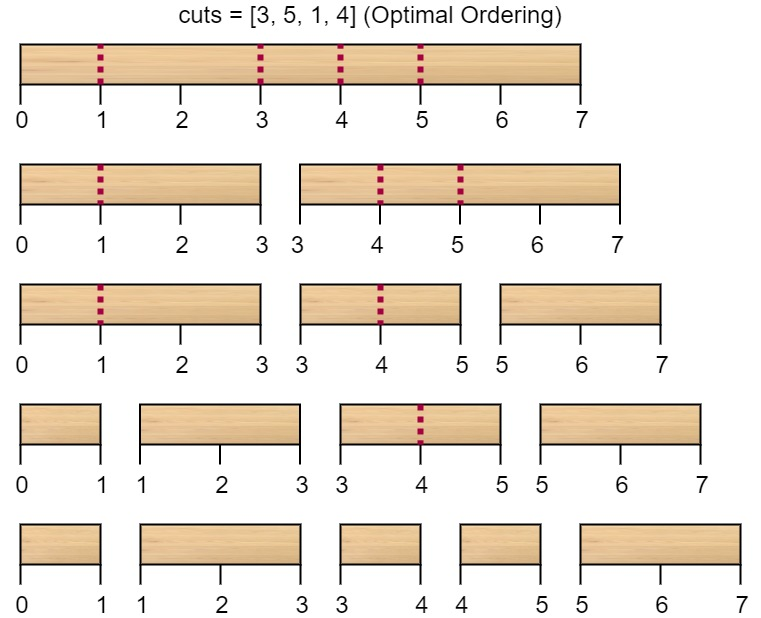

# 05.04.03 练习题目（第 11 天）

## 1. [0486. 预测赢家](https://leetcode.cn/problems/predict-the-winner/)

### 1.1 题目大意

**描述**：给定搞一个整数数组 $nums$。玩家 $1$ 和玩家 $2$ 基于这个数组设计了一个游戏。

玩家 $1$ 和玩家 $2$ 轮流进行自己的回合，玩家 $1$ 先手。

开始时，两个玩家的初始分值都是 $0$。每一回合，玩家从数组的任意一端取一个数字（即 $nums[0]$ 或 $nums[nums.length - 1]$），取到的数字将会从数组中移除（数组长度减 $1$）。玩家选中的数字将会加到他的得分上。当数组中没有剩余数字可取时，游戏结束。

**要求**：如果玩家 $1$ 能成为赢家，则返回 `True`。否则返回 `False`。如果两个玩家得分相等，同样认为玩家 $1$ 是游戏的赢家，也返回 `True`。假设每个玩家的玩法都会使他的分数最大化。

**说明**：

- $1 \le nums.length \le 20$。
- $0 \le nums[i] \le 10^7$。

**示例**：

- 示例 1：

```python
输入：nums = [1,5,2]
输出：False
解释：一开始，玩家 1 可以从 1 和 2 中进行选择。
如果他选择 2（或者 1 ），那么玩家 2 可以从 1（或者 2 ）和 5 中进行选择。如果玩家 2 选择了 5 ，那么玩家 1 则只剩下 1（或者 2 ）可选。 
所以，玩家 1 的最终分数为 1 + 2 = 3，而玩家 2 为 5 。
因此，玩家 1 永远不会成为赢家，返回 False。
```

- 示例 2：

```python
输入：nums = [1,5,233,7]
输出：True
解释：玩家 1 一开始选择 1 。然后玩家 2 必须从 5 和 7 中进行选择。无论玩家 2 选择了哪个，玩家 1 都可以选择 233 。
最终，玩家 1（234 分）比玩家 2（12 分）获得更多的分数，所以返回 True，表示玩家 1 可以成为赢家。
```

## 2. [1547. 切棍子的最小成本](https://leetcode.cn/problems/minimum-cost-to-cut-a-stick/)

### 2.1 题目大意

**描述**：给定一个整数 $n$，代表一根长度为 $n$ 个单位的木根，木棍从 $0 \sim n$ 标记了若干位置。例如，长度为 $6$ 的棍子可以标记如下：


再给定一个整数数组 $cuts$，其中 $cuts[i]$ 表示需要将棍子切开的位置。

我们可以按照顺序完成切割，也可以根据需要更改切割顺序。

每次切割的成本都是当前要切割的棍子的长度，切棍子的总成本是所有次切割成本的总和。对棍子进行切割将会把一根木棍分成两根较小的木棍（这两根小木棍的长度和就是切割前木棍的长度）。

**要求**：返回切棍子的最小总成本。

**说明**：

- $2 \le n \le 10^6$。
- $1 \le cuts.length \le min(n - 1, 100)$。
- $1 \le cuts[i] \le n - 1$。
- $cuts$ 数组中的所有整数都互不相同。

**示例**：

- 示例 1：



```python
输入：n = 7, cuts = [1,3,4,5]
输出：16
解释：按 [1, 3, 4, 5] 的顺序切割的情况如下所示。
第一次切割长度为 7 的棍子，成本为 7 。第二次切割长度为 6 的棍子（即第一次切割得到的第二根棍子），第三次切割为长度 4 的棍子，最后切割长度为 3 的棍子。总成本为 7 + 6 + 4 + 3 = 20 。而将切割顺序重新排列为 [3, 5, 1, 4] 后，总成本 = 16（如示例图中 7 + 4 + 3 + 2 = 16）。
```


- 示例 2：

```python
输入：n = 9, cuts = [5,6,1,4,2]
输出：22
解释：如果按给定的顺序切割，则总成本为 25。总成本 <= 25 的切割顺序很多，例如，[4, 6, 5, 2, 1] 的总成本 = 22，是所有可能方案中成本最小的。
```

## 3. [0664. 奇怪的打印机](https://leetcode.cn/problems/strange-printer/)

### 3.1 题目大意

**描述**：有一台奇怪的打印机，有以下两个功能：

1. 打印机每次只能打印由同一个字符组成的序列，比如：`"aaaa"`、`"bbb"`。
2. 每次可以从起始位置到结束的任意为止打印新字符，并且会覆盖掉原有字符。

现在给定一个字符串 $s$。

**要求**：计算这个打印机打印出字符串 $s$ 需要的最少打印次数。

**说明**：

- $1 \le s.length \le 100$。
- $s$ 由小写英文字母组成。

**示例**：

- 示例 1：

```python
输入：s = "aaabbb"
输出：2
解释：首先打印 "aaa" 然后打印 "bbb"。
```

- 示例 2：

```python
输入：s = "aba"
输出：2
解释：首先打印 "aaa" 然后在第二个位置打印 "b" 覆盖掉原来的字符 'a'。
```

