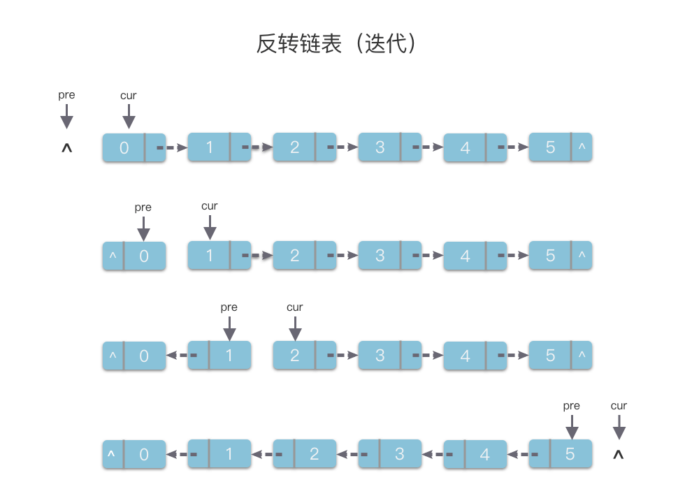
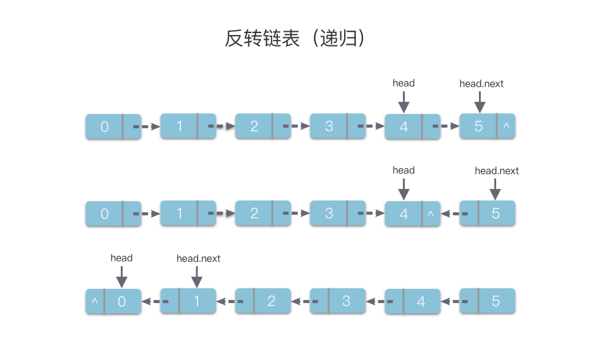

# 02.01.02 习题解析（第 01 天）

## 1. [0707. 设计链表](https://leetcode.cn/problems/design-linked-list/)

### 1.1 题目大意

**要求**：设计实现一个链表，需要支持以下操作：

- `get(index)`：获取链表中第 `index` 个节点的值。如果索引无效，则返回 `-1`。
- `addAtHead(val)`：在链表的第一个元素之前添加一个值为 `val` 的节点。插入后，新节点将成为链表的第一个节点。
- `addAtTail(val)`：将值为 `val` 的节点追加到链表的最后一个元素。
- `addAtIndex(index, val)`：在链表中的第 `index` 个节点之前添加值为 `val`  的节点。如果 `index` 等于链表的长度，则该节点将附加到链表的末尾。如果 `index` 大于链表长度，则不会插入节点。如果 `index` 小于 `0`，则在头部插入节点。
- `deleteAtIndex(index)`：如果索引 `index` 有效，则删除链表中的第 `index` 个节点。

**说明**：

- 所有`val`值都在 $[1, 1000]$ 之内。
- 操作次数将在 $[1, 1000]$ 之内。
- 请不要使用内置的 `LinkedList` 库。

**示例**：

```python
MyLinkedList linkedList = new MyLinkedList();
linkedList.addAtHead(1);
linkedList.addAtTail(3);
linkedList.addAtIndex(1,2);   // 链表变为 1 -> 2 -> 3
linkedList.get(1);            // 返回 2
linkedList.deleteAtIndex(1);  // 现在链表是 1-> 3
linkedList.get(1);            // 返回 3
```

### 1.2 解题思路

#### 思路 1：单链表

新建一个带有 `val` 值 和 `next` 指针的链表节点类， 然后按照要求对节点进行操作。

#### 思路 1：代码

```python
class ListNode:
    def __init__(self, x):
        self.val = x
        self.next = None


class MyLinkedList:
    def __init__(self):
        """
        Initialize your data structure here.
        """
        self.size = 0
        self.head = ListNode(0)


    def get(self, index: int) -> int:
        """
        Get the value of the index-th node in the linked list. If the index is invalid, return -1.
        """
        if index < 0 or index >= self.size:
            return -1

        curr = self.head
        for _ in range(index + 1):
            curr = curr.next
        return curr.val


    def addAtHead(self, val: int) -> None:
        """
        Add a node of value val before the first element of the linked list. After the insertion, the new node will be the first node of the linked list.
        """
        self.addAtIndex(0, val)


    def addAtTail(self, val: int) -> None:
        """
        Append a node of value val to the last element of the linked list.
        """
        self.addAtIndex(self.size, val)


    def addAtIndex(self, index: int, val: int) -> None:
        """
        Add a node of value val before the index-th node in the linked list. If index equals to the length of linked list, the node will be appended to the end of linked list. If index is greater than the length, the node will not be inserted.
        """
        if index > self.size:
            return

        if index < 0:
            index = 0

        self.size += 1
        pre = self.head
        for _ in range(index):
            pre = pre.next

        add_node = ListNode(val)
        add_node.next = pre.next
        pre.next = add_node


    def deleteAtIndex(self, index: int) -> None:
        """
        Delete the index-th node in the linked list, if the index is valid.
        """
        if index < 0 or index >= self.size:
            return

        self.size -= 1
        pre = self.head
        for _ in range(index):
            pre = pre.next

        pre.next = pre.next.next
```

#### 思路 1：复杂度分析

- **时间复杂度**：
  - `addAtHead(val)`：$O(1)$。
  - `get(index)`、`addAtTail(val)`、`del eteAtIndex(index)`：$O(k)$。$k$ 指的是元素的索引。
  - `addAtIndex(index, val)`：$O(n)$。$n$ 指的是链表的元素个数。

- **空间复杂度**：$O(1)$。

#### 思路 2：双链表

新建一个带有 `val` 值和 `next` 指针、`prev` 指针的链表节点类，然后按照要求对节点进行操作。

#### 思路 2：代码

```python
class ListNode:
    def __init__(self, x):
        self.val = x
        self.next = None
        self.prev = None

class MyLinkedList:
    def __init__(self):
        """
        Initialize your data structure here.
        """
        self.size = 0
        self.head = ListNode(0)
        self.tail = ListNode(0)
        self.head.next = self.tail
        self.tail.prev = self.head


    def get(self, index: int) -> int:
        """
        Get the value of the index-th node in the linked list. If the index is invalid, return -1.
        """
        if index < 0 or index >= self.size:
            return -1

        if index + 1 < self.size - index:
            curr = self.head
            for _ in range(index + 1):
                curr = curr.next
        else:
            curr = self.tail
            for _ in range(self.size - index):
                curr = curr.prev
        return curr.val


    def addAtHead(self, val: int) -> None:
        """
        Add a node of value val before the first element of the linked list. After the insertion, the new node will be the first node of the linked list.
        """
        self.addAtIndex(0, val)


    def addAtTail(self, val: int) -> None:
        """
        Append a node of value val to the last element of the linked list.
        """
        self.addAtIndex(self.size, val)


    def addAtIndex(self, index: int, val: int) -> None:
        """
        Add a node of value val before the index-th node in the linked list. If index equals to the length of linked list, the node will be appended to the end of linked list. If index is greater than the length, the node will not be inserted.
        """
        if index > self.size:
            return

        if index < 0:
            index = 0

        if index < self.size - index:
            prev = self.head
            for _ in range(index):
                prev = prev.next
            next = prev.next
        else:
            next = self.tail
            for _ in range(self.size - index):
                next = next.prev
            prev = next.prev

        self.size += 1
        add_node = ListNode(val)
        add_node.prev = prev
        add_node.next = next
        prev.next = add_node
        next.prev = add_node

    def deleteAtIndex(self, index: int) -> None:
        """
        Delete the index-th node in the linked list, if the index is valid.
        """
        if index < 0 or index >= self.size:
            return

        if index < self.size - index:
            prev = self.head
            for _ in range(index):
                prev = prev.next
            next = prev.next.next
        else:
            next = self.tail
            for _ in range(self.size - index - 1):
                next = next.prev
            prev = next.prev.prev

        self.size -= 1
        prev.next = next
        next.prev = prev
```

#### 思路 2：复杂度分析

- **时间复杂度**：
  - `addAtHead(val)`、`addAtTail(val)`：$O(1)$。
  - `get(index)`、`addAtIndex(index, val)`、`del eteAtIndex(index)`：$O(min(k, n - k))$。$n$ 指的是链表的元素个数，$k$ 指的是元素的索引。
- **空间复杂度**：$O(1)$。

## 2. [0206. 反转链表](https://leetcode.cn/problems/reverse-linked-list/)

### 2.1 题目大意

**描述**：给定一个单链表的头节点 `head`。

**要求**：将该单链表进行反转。可以迭代或递归地反转链表。

**说明**：

- 链表中节点的数目范围是 $[0, 5000]$。
- $-5000 \le Node.val \le 5000$。

**示例**：

```python
输入：head = [1,2,3,4,5]
输出：[5,4,3,2,1]

解释
翻转前    1->2->3->4->5->NULL
反转后    5->4->3->2->1->NULL
```

### 2.2 解题思路

#### 思路 1：迭代

1. 使用两个指针 `cur` 和 `pre` 进行迭代。`pre` 指向 `cur` 前一个节点位置。初始时，`pre` 指向 `None`，`cur` 指向 `head`。

2. 将 `pre` 和 `cur` 的前后指针进行交换，指针更替顺序为：
   1. 使用 `next` 指针保存当前节点 `cur` 的后一个节点，即 `next = cur.next`；
   2. 断开当前节点 `cur` 的后一节点链接，将 `cur` 的 `next` 指针指向前一节点 `pre`，即 `cur.next = pre`；
   3. `pre` 向前移动一步，移动到 `cur` 位置，即 `pre = cur`；
   4. `cur` 向前移动一步，移动到之前 `next` 指针保存的位置，即 `cur = next`。
3. 继续执行第 2 步中的 1、2、3、4。
4. 最后等到 `cur` 遍历到链表末尾，即 `cur == None`，时，`pre` 所在位置就是反转后链表的头节点，返回新的头节点 `pre`。

使用迭代法反转链表的示意图如下所示：



#### 思路 1：代码

```python
class Solution:
    def reverseList(self, head: ListNode) -> ListNode:
        pre = None
        cur = head
        while cur != None:
            next = cur.next
            cur.next = pre
            pre = cur
            cur = next
        return pre
```

#### 思路 1：复杂度分析

- **时间复杂度**：$O(n)$。
- **空间复杂度**：$O(1)$。

#### 思路 2：递归

具体做法如下：

1. 首先定义递归函数含义为：将链表反转，并返回反转后的头节点。
2. 然后从 `head.next` 的位置开始调用递归函数，即将 `head.next` 为头节点的链表进行反转，并返回该链表的头节点。
3. 递归到链表的最后一个节点，将其作为最终的头节点，即为 `new_head`。
4. 在每次递归函数返回的过程中，改变 `head` 和 `head.next` 的指向关系。也就是将 `head.next` 的`next` 指针先指向当前节点 `head`，即 `head.next.next = head `。
5. 然后让当前节点 `head` 的 `next` 指针指向 `None`，从而实现从链表尾部开始的局部反转。
6. 当递归从末尾开始顺着递归栈的退出，从而将整个链表进行反转。
7. 最后返回反转后的链表头节点 `new_head`。

使用递归法反转链表的示意图如下所示：



#### 思路 2：代码

```python
class Solution:
    def reverseList(self, head: ListNode) -> ListNode:
        if head == None or head.next == None:
            return head
        new_head = self.reverseList(head.next)
        head.next.next = head
        head.next = None
        return new_head
```

#### 思路 2：复杂度分析

- **时间复杂度**：$O(n)$
- **空间复杂度**：$O(n)$。最多需要 $n$ 层栈空间。

## 3. [0203. 移除链表元素](https://leetcode.cn/problems/remove-linked-list-elements/)

### 3.1 题目大意

**描述**：给定一个链表的头节点 `head` 和一个值 `val`。

**要求**：删除链表中值为 `val` 的节点，并返回新的链表头节点。

**说明**：

- 列表中的节点数目在范围 $[0, 10^4]$ 内。
- $1 \le Node.val \le 50$。
- $0 \le val \le 50$。

**示例**：


```python
输入：head = [1,2,6,3,4,5,6], val = 6
输出：[1,2,3,4,5]


输入：head = [], val = 1
输出：[]
```

### 3.2 解题思路

#### 思路 1：迭代

- 使用两个指针 `prev` 和 `curr`。`prev` 指向前一节点和当前节点，`curr` 指向当前节点。
- 从前向后遍历链表，遇到值为 `val` 的节点时，将 `prev` 的 `next` 指针指向当前节点的下一个节点，继续递归遍历。没有遇到则将 `prev` 指针向后移动一步。
- 向右移动 `curr`，继续遍历。

需要注意的是：因为要删除的节点可能包含了头节点，我们可以考虑在遍历之前，新建一个头节点，让其指向原来的头节点。这样，最终如果删除的是头节点，则直接删除原头节点，然后最后返回新建头节点的下一个节点即可。

#### 思路 1：代码

```python
class Solution:
    def removeElements(self, head: ListNode, val: int) -> ListNode:
        newHead = ListNode(0, head)
        newHead.next = head

        prev, curr = newHead, head
        while curr:
            if curr.val == val:
                prev.next = curr.next
            else:
                prev = curr
            curr = curr.next
        return newHead.next
```

#### 思路 1：复杂度分析

- **时间复杂度**：$O(n)$。
- **空间复杂度**：$O(1)$。

## 参考资料

- 【题解】[反转链表 - 反转链表 - 力扣](https://leetcode.cn/problems/reverse-linked-list/solution/fan-zhuan-lian-biao-by-leetcode-solution-d1k2/)
- 【题解】[【反转链表】：双指针，递归，妖魔化的双指针 - 反转链表 - 力扣（LeetCode）](https://leetcode.cn/problems/reverse-linked-list/solution/fan-zhuan-lian-biao-shuang-zhi-zhen-di-gui-yao-mo-/)