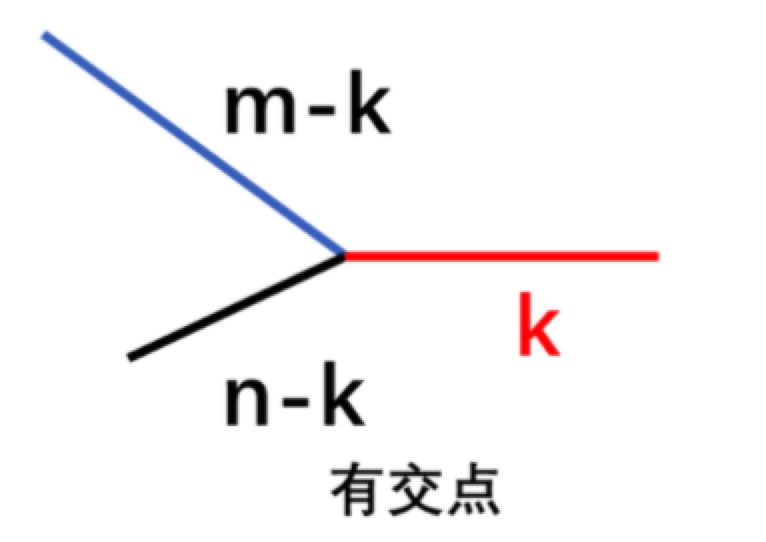

# 06.03.04 习题解析（第 12 天）

## 1. [0160. 相交链表](https://leetcode.cn/problems/intersection-of-two-linked-lists/)

### 1.1 题目大意

**描述**：给定 `listA`、`listB` 两个链表。

**要求**：判断两个链表是否相交，返回相交的起始点。如果不相交，则返回 `None`。

**说明**：

- `listA` 中节点数目为 $m$。
- `listB` 中节点数目为 $n$。
- $1 \le m, n \le 3 * 10^4$。
- $1 \le Node.val \le 10^5$。
- $0 \le skipA \le m$。
- $0 \le skipB \le n$。
- 如果 `listA` 和 `listB` 没有交点，`intersectVal` 为 $0$。
- 如果 `listA` 和 `listB` 有交点，`intersectVal == listA[skipA] == listB[skipB]`。

**示例**：

- 示例 1：


```Python
输入：intersectVal = 8, listA = [4,1,8,4,5], listB = [5,6,1,8,4,5], skipA = 2, skipB = 3
输出：Intersected at '8'
解释：相交节点的值为 8 （注意，如果两个链表相交则不能为 0）。
从各自的表头开始算起，链表 A 为 [4,1,8,4,5]，链表 B 为 [5,6,1,8,4,5]。
在 A 中，相交节点前有 2 个节点；在 B 中，相交节点前有 3 个节点。
— 请注意相交节点的值不为 1，因为在链表 A 和链表 B 之中值为 1 的节点 (A 中第二个节点和 B 中第三个节点) 是不同的节点。换句话说，它们在内存中指向两个不同的位置，而链表 A 和链表 B 中值为 8 的节点 (A 中第三个节点，B 中第四个节点) 在内存中指向相同的位置。
```

- 示例 2：


```Python
输入：intersectVal = 2, listA = [1,9,1,2,4], listB = [3,2,4], skipA = 3, skipB = 1
输出：Intersected at '2'
解释：相交节点的值为 2 （注意，如果两个链表相交则不能为 0）。
从各自的表头开始算起，链表 A 为 [1,9,1,2,4]，链表 B 为 [3,2,4]。
在 A 中，相交节点前有 3 个节点；在 B 中，相交节点前有 1 个节点。
```

### 1.2 解题思路

#### 思路 1：双指针

如果两个链表相交，那么从相交位置开始，到结束，必有一段等长且相同的节点。假设链表 `listA` 的长度为 $m$、链表 `listB` 的长度为 $n$，他们的相交序列有 $k$ 个，则相交情况可以如下如所示：



现在问题是如何找到 $m - k$ 或者 $n - k$ 的位置。

考虑将链表 `listA` 的末尾拼接上链表 `listB`，链表 `listB` 的末尾拼接上链表 `listA`。

然后使用两个指针 `pA` 、`pB`，分别从链表 `listA`、链表 `listB` 的头节点开始遍历，如果走到共同的节点，则返回该节点。

否则走到两个链表末尾，返回 `None`。


#### 思路 1：代码

```Python
class Solution:
    def getIntersectionNode(self, headA: ListNode, headB: ListNode) -> ListNode:
        if headA == None or headB == None:
            return None
        pA = headA
        pB = headB
        while pA != pB:
            pA = pA.next if pA != None else headB
            pB = pB.next if pB != None else headA
        return pA
```

#### 思路 1：复杂度分析

- **时间复杂度**：$O(m + n)$。
- **空间复杂度**：$O(1)$。

## 2. [0019. 删除链表的倒数第 N 个结点](https://leetcode.cn/problems/remove-nth-node-from-end-of-list/)

### 2.1 题目大意

**描述**：给定一个链表的头节点 `head`。

**要求**：删除链表的倒数第 `n` 个节点，并且返回链表的头节点。

**说明**：

- 要求使用一次遍历实现。
- 链表中结点的数目为 `sz`。
- $1 \le sz \le 30$。
- $0 \le Node.val \le 100$。
- $1 \le n \le sz$。

**示例**：

- 示例 1：


```Python
输入：head = [1,2,3,4,5], n = 2
输出：[1,2,3,5]
```

- 示例 2：

```Python
输入：head = [1], n = 1
输出：[]
```

### 2.2 解题思路

#### 思路 1：快慢指针

常规思路是遍历一遍链表，求出链表长度，再遍历一遍到对应位置，删除该位置上的节点。

如果用一次遍历实现的话，可以使用快慢指针。让快指针先走 `n` 步，然后快慢指针、慢指针再同时走，每次一步，这样等快指针遍历到链表尾部的时候，慢指针就刚好遍历到了倒数第 `n` 个节点位置。将该位置上的节点删除即可。

需要注意的是要删除的节点可能包含了头节点。我们可以考虑在遍历之前，新建一个头节点，让其指向原来的头节点。这样，最终如果删除的是头节点，则删除原头节点即可。返回结果的时候，可以直接返回新建头节点的下一位节点。

#### 思路 1：代码

```Python
class Solution:
    def removeNthFromEnd(self, head: ListNode, n: int) -> ListNode:
        newHead = ListNode(0, head)
        fast = head
        slow = newHead
        while n:
            fast = fast.next
            n -= 1
        while fast:
            fast = fast.next
            slow = slow.next
        slow.next = slow.next.next
        return newHead.next
```

#### 思路 1：复杂度分析

- **时间复杂度**：$O(n)$。
- **空间复杂度**：$O(1)$。

## 3. [0143. 重排链表](https://leetcode.cn/problems/reorder-list/)

### 3.1 题目大意

**描述**：给定一个单链表 `L` 的头节点 `head`，单链表 `L` 表示为：$L_0$ -> $L_1$ -> $L_2$ -> ... -> $L_{n-1}$ -> $L_n$。

**要求**：将单链表 `L` 重新排列为：$L_0$ -> $L_n$ -> $L_1$ -> $L_{n-1}$ -> $L_2$ -> $L_{n-2}$ -> $L_3$ -> $L_{n-3}$ -> ...。

**说明**：

- 需要将实际节点进行交换。

**示例**：

- 示例 1：


```Python
输入：head = [1,2,3,4]
输出：[1,4,2,3]
```

- 示例 2：


```Python
输入：head = [1,2,3,4,5]
输出：[1,5,2,4,3]
```

### 3.2 解题思路    

#### 思路 1：线性表

因为链表无法像数组那样直接进行随机访问。所以我们可以先将链表转为线性表，然后直接按照提要要求的排列顺序访问对应数据元素，重新建立链表。

#### 思路 1：代码

```Python
class Solution:
    def reorderList(self, head: ListNode) -> None:
        """
        Do not return anything, modify head in-place instead.
        """
        if not head:
            return

        vec = []
        node = head
        while node:
            vec.append(node)
            node = node.next

        left, right = 0, len(vec) - 1
        while left < right:
            vec[left].next = vec[right]
            left += 1
            if left == right:
                break
            vec[right].next = vec[left]
            right -= 1
        vec[left].next = None
```

#### 思路 1：复杂度分析

- **时间复杂度**：$O(n)$。
- **空间复杂度**：$O(n)$。
