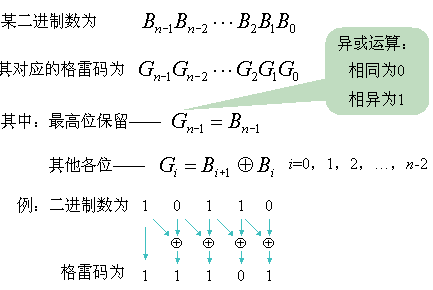

# 0089. 格雷编码

- 标签：位运算、数学、回溯
- 难度：中等

## 题目链接

- [0089. 格雷编码 - 力扣](https://leetcode.cn/problems/gray-code/)

## 题目大意

**描述**：给定一个整数 $n$。

**要求**：返回任一有效的 $n$ 位格雷码序列。

**说明**：

- **n 位格雷码序列**：是一个由 $2^n$ 个整数组成的序列，其中：
  - 每个整数都在范围 $[0, 2^n - 1]$ 内（含 $0$ 和 $2^n - 1$）。
  - 第一个整数是 $0$。
  - 一个整数在序列中出现不超过一次。
  - 每对相邻整数的二进制表示恰好一位不同 ，且第一个和最后一个整数的二进制表示恰好一位不同。

- $1 \le n \le 16$。

**示例**：

- 示例 1：

```python
输入：n = 2
输出：[0,1,3,2]
解释：
[0,1,3,2] 的二进制表示是 [00,01,11,10] 。
- 00 和 01 有一位不同
- 01 和 11 有一位不同
- 11 和 10 有一位不同
- 10 和 00 有一位不同
[0,2,3,1] 也是一个有效的格雷码序列，其二进制表示是 [00,10,11,01] 。
- 00 和 10 有一位不同
- 10 和 11 有一位不同
- 11 和 01 有一位不同
- 01 和 00 有一位不同
```

- 示例 2：

```python
输入：n = 1
输出：[0,1]
```

## 解题思路

### 思路 1：位运算 + 公式法

- 格雷编码生成规则：以二进制值为 $0$ 的格雷编码作为第 $0$ 项，第一次改变最右边的数位，第二次改变从右边数第一个为 $1$ 的数位左边的数位，第三次跟第一次一样，改变最右边的数位，第四次跟第二次一样，改变从右边数第一个为 $1$ 的数位左边的数位。此后，第五、六次，第七、八次 ... 都跟第一二次一样反复进行，直到生成 $2^n$​ 个格雷编码。

- 也可以直接利用二进制转换为格雷编码公式：

  

### 思路 1：代码

```python
class Solution:
    def grayCode(self, n: int) -> List[int]:
        gray = []
        binary = 0
        while binary < (1 << n):
            gray.append(binary ^ binary >> 1)
            binary += 1
        return gray
```

### 思路 1：复杂度分析

- **时间复杂度**：$O(2^n)$。
- **空间复杂度**：$O(1)$。
