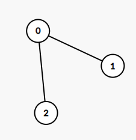
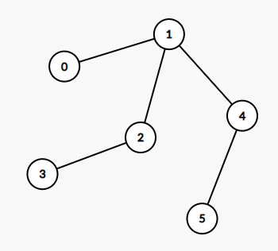

# [1245. 树的直径](https://leetcode.cn/problems/tree-diameter/)

- 标签：树、深度优先搜索、广度优先搜索、图、拓扑排序
- 难度：中等

## 题目链接

- [1245. 树的直径 - 力扣](https://leetcode.cn/problems/tree-diameter/)

## 题目大意

**描述**：给定一个数组 $edges$，用来表示一棵无向树。其中 $edges[i] = [u, v]$ 表示节点 $u$ 和节点 $v$ 之间的双向边。书上的节点编号为 $0 \sim edges.length$，共 $edges.length + 1$ 个节点。

**要求**：求出这棵无向树的直径。

**说明**：

- $0 \le edges.length < 10^4$。
- $edges[i][0] \ne edges[i][1]$。
- $0 \le edges[i][j] \le edges.length$。
- $edges$ 会形成一棵无向树。

**示例**：

- 示例 1：



```python
输入：edges = [[0,1],[0,2]]
输出：2
解释：
这棵树上最长的路径是 1 - 0 - 2，边数为 2。
```

- 示例 2：



```python
输入：edges = [[0,1],[1,2],[2,3],[1,4],[4,5]]
输出：4
解释： 
这棵树上最长的路径是 3 - 2 - 1 - 4 - 5，边数为 4。
```

## 解题思路

### 思路 1：树形 DP + 深度优先搜索

对于根节点为 $u$ 的树来说：

1. 如果其最长路径经过根节点 $u$，则：**最长路径长度 = 某子树中的最长路径长度 + 另一子树中的最长路径长度 + 1**。
2. 如果其最长路径不经过根节点 $u$，则：**最长路径长度 = 某个子树中的最长路径长度**。

即：**最长路径长度 = max(某子树中的最长路径长度 + 另一子树中的最长路径长度 + 1，某个子树中的最长路径长度)**。

对此，我们可以使用深度优先搜索递归遍历 $u$ 的所有相邻节点 $v$，并在递归遍历的同时，维护一个全局最大路径和变量 $ans$，以及当前节点 $u$ 的最大路径长度变量 $u\underline{\hspace{0.5em}}len$。

1. 先计算出从相邻节点 $v$ 出发的最长路径长度 $v\underline{\hspace{0.5em}}len$。
2. 更新维护全局最长路径长度为 $self.ans = max(self.ans, \quad u\underline{\hspace{0.5em}}len + v\underline{\hspace{0.5em}}len + 1)$。
3. 更新维护当前节点 $u$ 的最长路径长度为 $u\underline{\hspace{0.5em}}len = max(u\underline{\hspace{0.5em}}len, \quad v\underline{\hspace{0.5em}}len + 1)$。

> 注意：在遍历邻接节点的过程中，为了避免造成重复遍历，我们在使用深度优先搜索时，应过滤掉父节点。

### 思路 1：代码

```python
class Solution:
    def __init__(self):
        self.ans = 0

    def dfs(self, graph, u, fa):
        u_len = 0
        for v in graph[u]:
            if v != fa:
                v_len = self.dfs(graph, v, u)
                self.ans = max(self.ans, u_len + v_len + 1)
                u_len = max(u_len, v_len + 1)
        return u_len

    def treeDiameter(self, edges: List[List[int]]) -> int:
        size = len(edges) + 1

        graph = [[] for _ in range(size)]
        for u, v in edges:
            graph[u].append(v)
            graph[v].append(u)
        
        self.dfs(graph, 0, -1)
        return self.ans
```

### 思路 1：复杂度分析

- **时间复杂度**：$O(n)$，其中 $n$ 为无向树中的节点个数。
- **空间复杂度**：$O(n)$。

