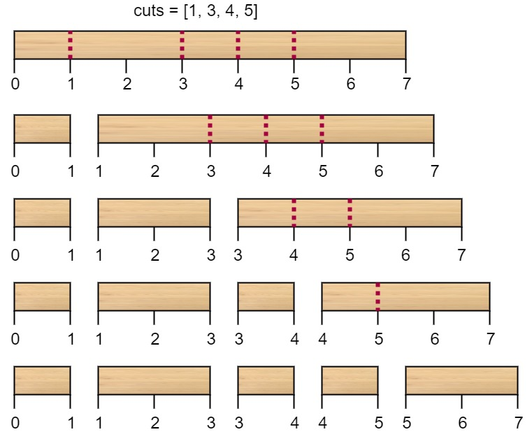

# 1547. 切棍子的最小成本

- 标签：数组、动态规划、排序
- 难度：困难

## 题目链接

- [1547. 切棍子的最小成本 - 力扣](https://leetcode.cn/problems/minimum-cost-to-cut-a-stick/)

## 题目大意

**描述**：给定一个整数 $n$，代表一根长度为 $n$ 个单位的木根，木棍从 $0 \sim n$ 标记了若干位置。例如，长度为 $6$ 的棍子可以标记如下：


再给定一个整数数组 $cuts$，其中 $cuts[i]$ 表示需要将棍子切开的位置。

我们可以按照顺序完成切割，也可以根据需要更改切割顺序。

每次切割的成本都是当前要切割的棍子的长度，切棍子的总成本是所有次切割成本的总和。对棍子进行切割将会把一根木棍分成两根较小的木棍（这两根小木棍的长度和就是切割前木棍的长度）。

**要求**：返回切棍子的最小总成本。

**说明**：

- $2 \le n \le 10^6$。
- $1 \le cuts.length \le min(n - 1, 100)$。
- $1 \le cuts[i] \le n - 1$。
- $cuts$ 数组中的所有整数都互不相同。

**示例**：

- 示例 1：


```python
输入：n = 7, cuts = [1,3,4,5]
输出：16
解释：按 [1, 3, 4, 5] 的顺序切割的情况如下所示。
第一次切割长度为 7 的棍子，成本为 7 。第二次切割长度为 6 的棍子（即第一次切割得到的第二根棍子），第三次切割为长度 4 的棍子，最后切割长度为 3 的棍子。总成本为 7 + 6 + 4 + 3 = 20 。而将切割顺序重新排列为 [3, 5, 1, 4] 后，总成本 = 16（如示例图中 7 + 4 + 3 + 2 = 16）。
```



- 示例 2：

```python
输入：n = 9, cuts = [5,6,1,4,2]
输出：22
解释：如果按给定的顺序切割，则总成本为 25。总成本 <= 25 的切割顺序很多，例如，[4, 6, 5, 2, 1] 的总成本 = 22，是所有可能方案中成本最小的。
```

## 解题思路

### 思路 1：动态规划

我们可以预先在数组 $cuts$ 种添加位置 $0$ 和位置 $n$，然后对数组 $cuts$ 进行排序。这样待切割的木棍就对应了数组中连续元素构成的「区间」。

###### 1. 划分阶段

按照区间长度进行阶段划分。

###### 2. 定义状态

定义状态 $dp[i][j]$ 表示为：切割区间为 $[i, j]$ 上的小木棍的最小成本。

###### 3. 状态转移方程

假设位置 $i$ 与位置 $j$ 之间最后一个切割的位置为 $k$，则 $dp[i][j]$ 取决与由 $k$ 作为切割点分割出的两个区间 $[i, k]$ 与 $[k, j]$ 上的最小成本 + 切割位置 $k$ 所带来的成本。

而切割位置 $k$ 所带来的成本是这段区间所代表的小木棍的长度，即 $cuts[j] - cuts[i]$。

则状态转移方程为：$dp[i][j] = min \lbrace dp[i][k] + dp[k][j] + cuts[j] - cuts[i] \rbrace, \quad i < k < j$

###### 4. 初始条件

- 相邻位置之间没有切割点，不需要切割，最小成本为 $0$，即 $dp[i - 1][i] = 0$。
- 其余位置默认为最小成本为一个极大值，即 $dp[i][j] = \infty, \quad i + 1 \ne j$。

###### 5. 最终结果

根据我们之前定义的状态，$dp[i][j]$ 表示为：切割区间为 $[i, j]$ 上的小木棍的最小成本。 所以最终结果为 $dp[0][size - 1]$。

### 思路 1：代码

```python
class Solution:
    def minCost(self, n: int, cuts: List[int]) -> int:
        cuts.append(0)
        cuts.append(n)
        cuts.sort()
        
        size = len(cuts)
        dp = [[float('inf') for _ in range(size)] for _ in range(size)]
        for i in range(1, size):
            dp[i - 1][i] = 0

        for l in range(3, size + 1):        # 枚举区间长度
            for i in range(size):           # 枚举区间起点
                j = i + l - 1               # 根据起点和长度得到终点                            
                if j >= size:      
                    continue
                dp[i][j] = float('inf')
                for k in range(i + 1, j):   # 枚举区间分割点
                    # 状态转移方程，计算合并区间后的最优值
                    dp[i][j] = min(dp[i][j], dp[i][k] + dp[k][j] + cuts[j] - cuts[i])
        return dp[0][size - 1]
```

### 思路 1：复杂度分析

- **时间复杂度**：$O(m^3)$，其中 $m$ 为数组 $cuts$ 的元素个数。
- **空间复杂度**：$O(m^2)$。
