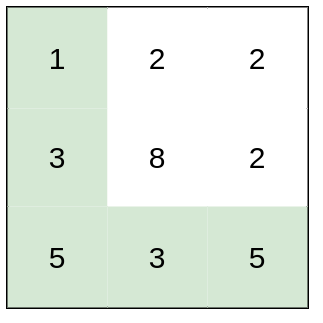

# 1631. 最小体力消耗路径

- 标签：深度优先搜索、广度优先搜索、并查集、数组、二分查找、矩阵、堆（优先队列）
- 难度：中等

## 题目链接

- [1631. 最小体力消耗路径 - 力扣](https://leetcode.cn/problems/path-with-minimum-effort/)

## 题目大意

**描述**：给定一个 $rows \times cols$ 大小的二维数组 $heights$，其中 $heights[i][j]$ 表示为位置 $(i, j)$ 的高度。

现在要从左上角 $(0, 0)$ 位置出发，经过方格的一些点，到达右下角 $(n - 1, n - 1)$  位置上。其中所经过路径的花费为「这条路径上所有相邻位置的最大高度差绝对值」。

**要求**：计算从 $(0, 0)$ 位置到 $(n - 1, n - 1)$  的最优路径的花费。

**说明**：

- **最优路径**：路径上「所有相邻位置最大高度差绝对值」最小的那条路径。
- $rows == heights.length$。
- $columns == heights[i].length$。
- $1 \le rows, columns \le 100$。
- $1 \le heights[i][j] \le 10^6$。

**示例**：

- 示例 1：



```python
输入：heights = [[1,2,2],[3,8,2],[5,3,5]]
输出：2
解释：路径 [1,3,5,3,5] 连续格子的差值绝对值最大为 2 。
这条路径比路径 [1,2,2,2,5] 更优，因为另一条路径差值最大值为 3。
```

- 示例 2：


```python
输入：heights = [[1,2,3],[3,8,4],[5,3,5]]
输出：1
解释：路径 [1,2,3,4,5] 的相邻格子差值绝对值最大为 1 ，比路径 [1,3,5,3,5] 更优。
```

## 解题思路

### 思路 1：并查集

将整个网络抽象为一个无向图，每个点与相邻的点（上下左右）之间都存在一条无向边，边的权重为两个点之间的高度差绝对值。

我们要找到左上角到右下角的最优路径，可以遍历所有的点，将所有的边存储到数组中，每条边的存储格式为 $[x, y, h]$，意思是编号 $x$ 的点和编号为 $y$ 的点之间的权重为 $h$。

然后按照权重从小到大的顺序，对所有边进行排序。

再按照权重大小遍历所有边，将其依次加入并查集中。并且每次都需要判断 $(0, 0)$ 点和 $(n - 1, n - 1)$ 点是否连通。

如果连通，则该边的权重即为答案。

### 思路 1：代码

```python
class UnionFind:

    def __init__(self, n):
        self.parent = [i for i in range(n)]
        self.count = n

    def find(self, x):
        while x != self.parent[x]:
            self.parent[x] = self.parent[self.parent[x]]
            x = self.parent[x]
        return x

    def union(self, x, y):
        root_x = self.find(x)
        root_y = self.find(y)
        if root_x == root_y:
            return

        self.parent[root_x] = root_y
        self.count -= 1

    def is_connected(self, x, y):
        return self.find(x) == self.find(y)

class Solution:
    def minimumEffortPath(self, heights: List[List[int]]) -> int:
        row_size = len(heights)
        col_size = len(heights[0])
        size = row_size * col_size
        edges = []
        for row in range(row_size):
            for col in range(col_size):
                if row < row_size - 1:
                    x = row * col_size + col
                    y = (row + 1) * col_size + col
                    h = abs(heights[row][col] - heights[row + 1][col])
                    edges.append([x, y, h])
                if col < col_size - 1:
                    x = row * col_size + col
                    y = row * col_size + col + 1
                    h = abs(heights[row][col] - heights[row][col + 1])
                    edges.append([x, y, h])

        edges.sort(key=lambda x: x[2])

        union_find = UnionFind(size)

        for edge in edges:
            x, y, h = edge[0], edge[1], edge[2]
            union_find.union(x, y)
            if union_find.is_connected(0, size - 1):
                return h
        return 0
```

### 思路 1：复杂度分析

- **时间复杂度**：$O(m \times n \times \alpha(m \times n))$，其中 $\alpha$ 是反 Ackerman 函数。
- **空间复杂度**：$O(m \times n)$。

